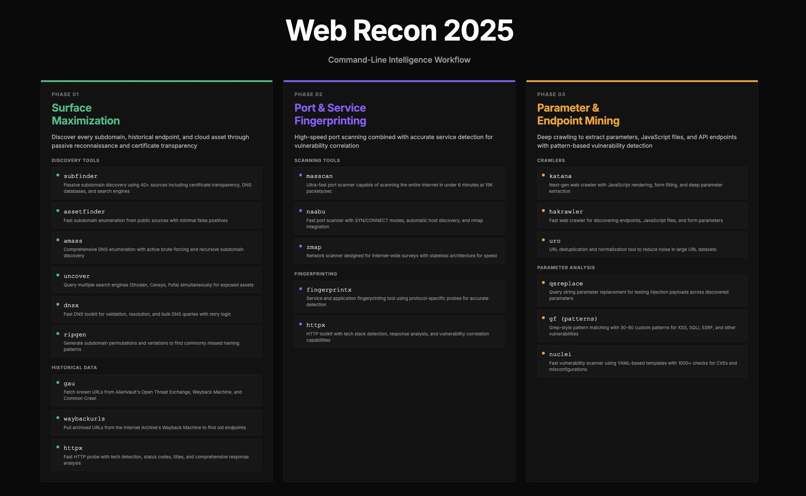

# Web Recon 2025 - Reconnaissance Framework

Complete automated reconnaissance framework implementing the Web Recon 2025 workflow with three phases, interactive parameter collection, parallel execution, and professional HTML reporting with Mermaid diagrams.



## Quick Start

```bash
cd ~/Documents/git/recon-framework
export PATH="$HOME/go/bin:$PATH"
./recon-3phase-demo.sh
```

## Files in This Directory

### Scripts
- **`recon-3phase.sh`** - Full-featured production version
- **`recon-3phase-demo.sh`** - Simplified, stable version (recommended)
- **`verify_recon_tools.sh`** - Tool verification utility

### Documentation
- **`README.md`** - This file
- **`README_3PHASE_RECON.md`** - Complete framework documentation
- **`RECON_3PHASE_USAGE.md`** - Detailed usage guide
- **`RECON_FRAMEWORK_SUMMARY.md`** - Quick start & overview
- **`RECON_TOOLS_SETUP.md`** - Tool installation reference
- **`QUICK_REFERENCE.md`** - Quick command reference

## Framework Overview

### Three Phases

**Phase 1: Surface Maximization**
- Subdomain discovery (subfinder, assetfinder)
- Historical URL discovery (gau, waybackurls)
- DNS resolution (dnsx)

**Phase 2: Port & Service Fingerprinting**
- Port scanning (naabu, masscan)
- HTTP/HTTPS probing (httpx, httprobe)

**Phase 3: Parameter & Endpoint Mining**
- Web crawling (katana)
- Pattern matching (gf)
- Vulnerability scanning (nuclei)

### Key Features

✅ Interactive parameter collection
✅ Parallel tool execution (3-4x faster)
✅ HTML report with Mermaid diagrams
✅ Automatic phase chaining
✅ Comprehensive logging
✅ 18 security tools integrated

## Usage

### Basic Run
```bash
./recon-3phase-demo.sh
```

### Verify Tools
```bash
./verify_recon_tools.sh
```

### View Report
```bash
firefox recon_20260114_115700/report.html
```

## Output Structure

```
recon_20260114_115700/
├── report.html              # HTML report with Mermaid diagrams
├── results/                 # All tool outputs
│   ├── phase1_*.txt        # Subdomains, URLs
│   ├── phase2_*.txt        # Ports, HTTP services
│   └── phase3_*.txt        # Crawled URLs, vulnerabilities
└── logs/                   # Execution logs
```

## Documentation

- **Complete Guide**: See `README_3PHASE_RECON.md`
- **Usage Instructions**: See `RECON_3PHASE_USAGE.md`
- **Quick Start**: See `RECON_FRAMEWORK_SUMMARY.md`
- **Tool Reference**: See `RECON_TOOLS_SETUP.md`
- **Command Reference**: See `QUICK_REFERENCE.md`

## Requirements

All 18 reconnaissance tools must be installed. Verify with:
```bash
./verify_recon_tools.sh
```

## Support

For issues:
1. Check logs: `cat recon_*/logs/phase*.log`
2. Verify tools: `./verify_recon_tools.sh`
3. Review documentation in this directory
4. Check individual tool documentation (links in README_3PHASE_RECON.md)

## Credit
prompt formulated from a tweet by [Deedy Das](https://x.com/deedydas/status/2011349400778653879)
